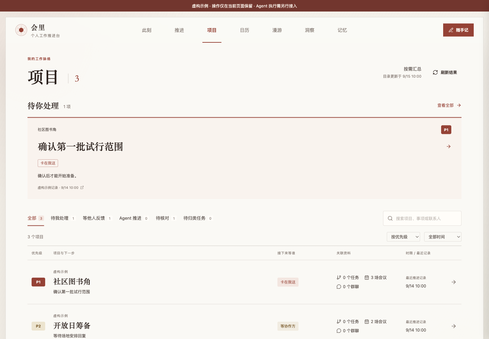

# 会里 Huili

**让会议之后，事情继续向前。**

交给你的首先是一个 **Agent Skill 包**。你的 Agent 用本人授权的资料和少量问题理解你的工作，再以包内前端为参考，在你的环境里生成可以持续使用的会里。它把会前准备、会议记录、会后推进和项目脉络接到同一条工作线上。

> 公开提供工作方法、前端源码、数据契约和连接器参考，按[个人与内部使用许可](LICENSE)供自用和修改。未经书面授权不得对外分享原版或修改版、售卖或包装推广；既有授权与平台权利见[许可说明](docs/LICENSE-FAQ.md)。首次使用需要 Agent 适配与验证；这里没有托管服务、预连账号或完整的自托管后端。

当前接手协议说明 Agent 如何生成个人前端；仓库本身尚未提供跨宿主的自动生成、部署或登录服务。

[项目海报](docs/images/huili-poster.png) · [首次生成个人会里](references/first-run.md) · [可选视觉定制](references/visual-customization.md) · [交给 Agent 接手](docs/TAKEOVER.md) · [Skill 入口](SKILL.md) · [能力与边界](docs/CAPABILITIES.md) · [接入契约](docs/ADAPTER.md) · [隐私说明](docs/PRIVACY.md) · [使用许可](docs/LICENSE-FAQ.md)



## 会里有什么用

- **会前，带着上下文进场。** 把历史会议、相关讨论与已授权资料放在一起，准备本次真正需要决定的问题。
- **会后，把讨论接到行动。** 从完整逐字稿出发，识别同场重复录音，区分决定、未定事项和行动；经过确认，把需要产物的工作交给 Agent。
- **项目，看清下一步等谁。** 把会议、任务、聊天和交付物关联起来，区分待我处理、等他人反馈、Agent 推进与待核对。责任有原文依据，进展有来源和日期。
- **随手记，念头有去处。** 先记下，再搜索、完成或撤销；需要继续做时，让 Agent 先找背景，再与本人对齐。
- **此刻，给意外留一点位置。** 今日留白是开放的作品空间，可以是文字、图像或安全的交互表达；可以收好、丢弃或再来一次，不必每次都落成一张管理建议卡。

## 把整个仓库交给你的 Agent

复制这一段即可开始共创：

```text
请阅读这个仓库的 SKILL.md 和 references/first-run.md。
请先核对我的 Agent、飞书 CLI、当前本人账号与已授权资料范围。
以近期少量会议及相关纪要了解我正在处理什么；资料不足再问我
“首屏先看什么、纪要怎样好用、会里能主动到什么程度”这三个轻问题。
如果我愿意深入聊，再追加采访。以原前端为参考，在我自己的目录
生成并预览一个能用的会里；说明哪些来自资料、哪些是我的选择。
默认沿用原来的视觉；如果我给出参考页面或审美偏好，再按我的选择调整。
先验收一场会议的读取、行动确认和真实产物回读，再逐步扩展。
缺失条件明确标记，别擅自扫描全部历史、开启后台任务或发消息。
```

本仓库没有硬性 Codex 依赖。Agent 能读取本地文件、运行所需命令并使用本人授权的资料，即可按文档接手。MCP 是可选接入方式，JSON CLI 也可调用。各宿主的实际能力与授权方式需要逐一核验，不能由工具导入成功推断全流程可用。

## 仓库里有什么

| 目录 | 交付内容 |
| --- | --- |
| `SKILL.md`、`references/`、`templates/` | 接手协议、首次生成与六条工作流、默认模板和验收条件 |
| `client/` | 会里原有设计体系下的 React 前端：此刻、推进、项目、日历、漫游、洞察、记忆、随手记 |
| `shared/` | 会议、行动、项目、来源、生成作品与反馈的数据契约 |
| `connector/` | 标准库 Python 实现的按需 MCP / JSON CLI 连接器，不内置模型或后台调度 |
| `examples/` | 完全虚构的页面示例、空白个人配置 |
| `docs/` | Agent 接手指南、接口说明、能力边界、脱敏与验证记录 |
| `scripts/`、`tests/` | 公开文件隐私扫描和针对性行为检查 |

### 只看前端参考

需要 Node.js 22.12+ 与 npm。安装依赖后显式启动示例模式：

```bash
npm ci
npm run demo
```

打开 `http://127.0.0.1:8136/?view=projects`。示例完全虚构，随手记操作只在当前页面保留，刷新后消失；执行 Agent、联网写入与后台调度均未接入。

```bash
npm run typecheck
npm test
python3 -m unittest discover -s connector -p 'test_*.py'
npm run build
```

连接器需要 Python 3.10+；请先核对实际 Python 版本。

`npm run dev` / `npm run build` 使用真实接入模式。需由你的 Agent 实现同源后端、本人认证和数据隔离；未连接时显示缺口。不要把密钥放进前端环境变量。

## 源码包包含的更新

除了会议日历、会前准备、会后行动和系列会议，已纳入较新的项目责任视图、随手记完成与撤销、背景交接，以及今日留白的开放表达与丢弃机制。公开前端展示与原运行环境的上线状态分开说明，详见[能力与边界](docs/CAPABILITIES.md)。v0.2.0 调整使用许可与说明，产品功能沿用 v0.1.0。

另补充了[首次生成个人会里](references/first-run.md)的接手协议和验收步骤；它尚未纳入已发布版本，也没有证明其他使用者的 Agent 已能自动完成生成。

## 隐私与许可

发布副本采用文件白名单和全新 Git 历史。移除作者个人画像、姓名别名、行业默认分类、真实会议、聊天、项目目录、源工作区路径、内部链接、实例标识、凭证、运行状态和旧截图。示例没有从真实业务数据中抽样。[隐私说明](docs/PRIVACY.md)

当前自有材料采用自定义的[会里个人与内部使用许可 1.0](LICENSE)，属于 **source-available（源码公开）**：

- **允许**个人和公司内部免费自用、修改，包括内部商业工作。
- **未经书面授权不允许**对外分享原版或修改版，即使免费或保留署名；也不允许售卖、收费托管、商业交付或包装成自己的项目推广。
- 保留原作者、来源与许可声明；可以分享原仓库链接，让他人从这里取得材料后自行使用。

**历史与平台边界：**v0.1.0 曾按 MIT 发布，新许可不追溯撤销其既有权利，也不能阻止依旧许可合法流传的旧材料。GitHub 公共仓库的站内 fork 等平台权利同样保留。详见[许可说明](docs/LICENSE-FAQ.md)。第三方依赖按各自许可使用，见 [THIRD_PARTY_NOTICES.md](THIRD_PARTY_NOTICES.md)。
